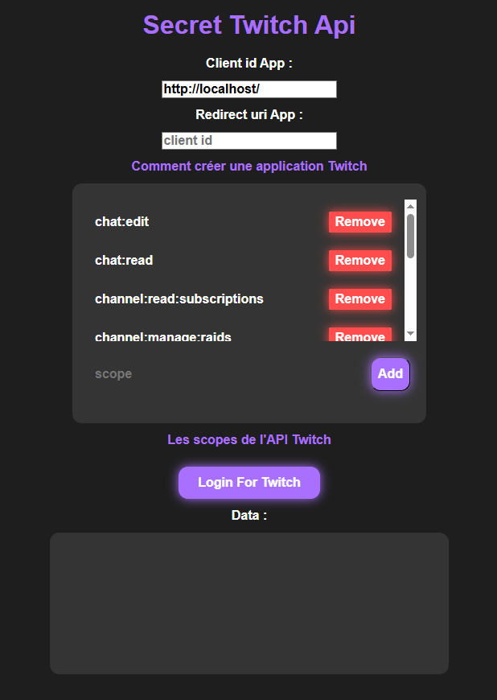

# Server Server

* npm
  ```sh
  npm install
  ```

* openssl
  ```sh
  openssl req -x509 -newkey rsa:2048 -nodes -keyout key.pem -out cert.pem -days 365 -config openssl.cnf -subj "/CN=localhost"
  ```

* npm
  ```sh
  npm start
  ```

* go to [http://localhost/](http://localhost/) or [https://localhost/](https://localhost/)


